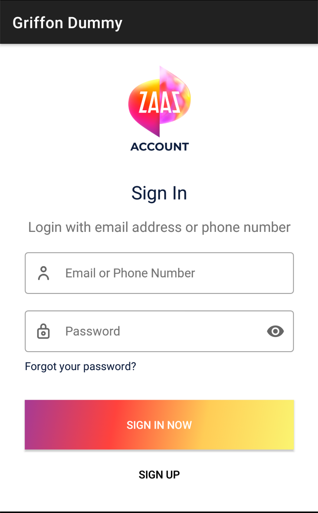
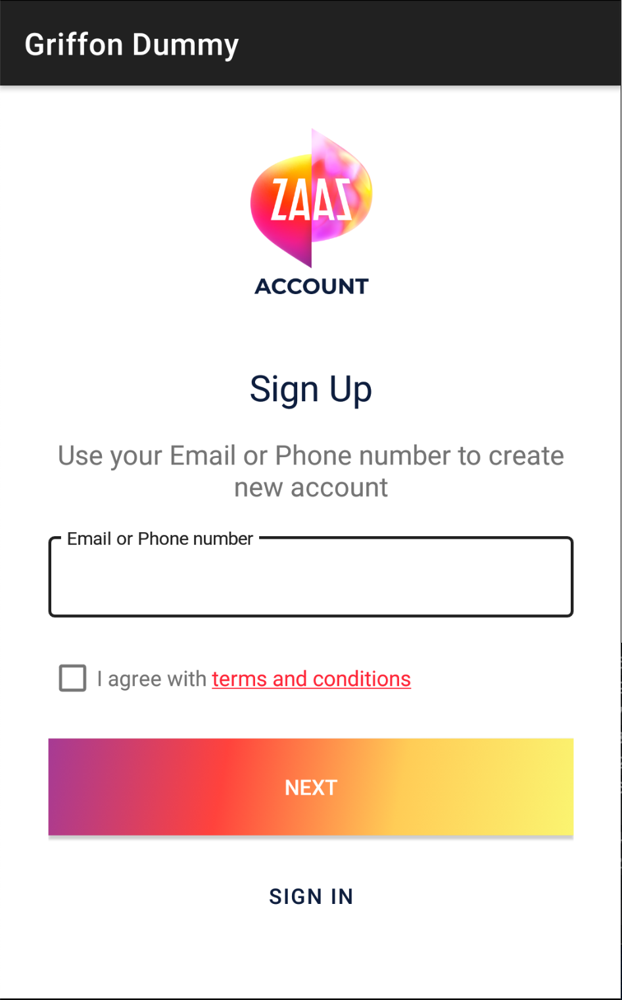
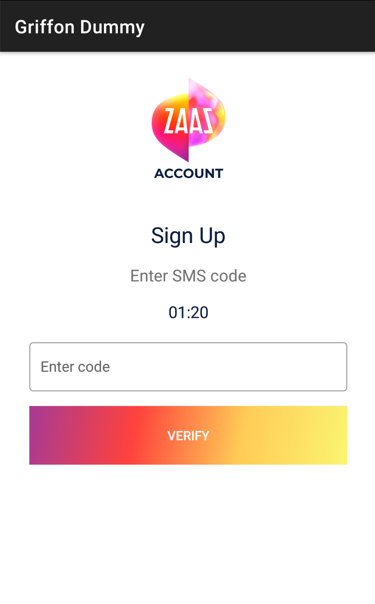
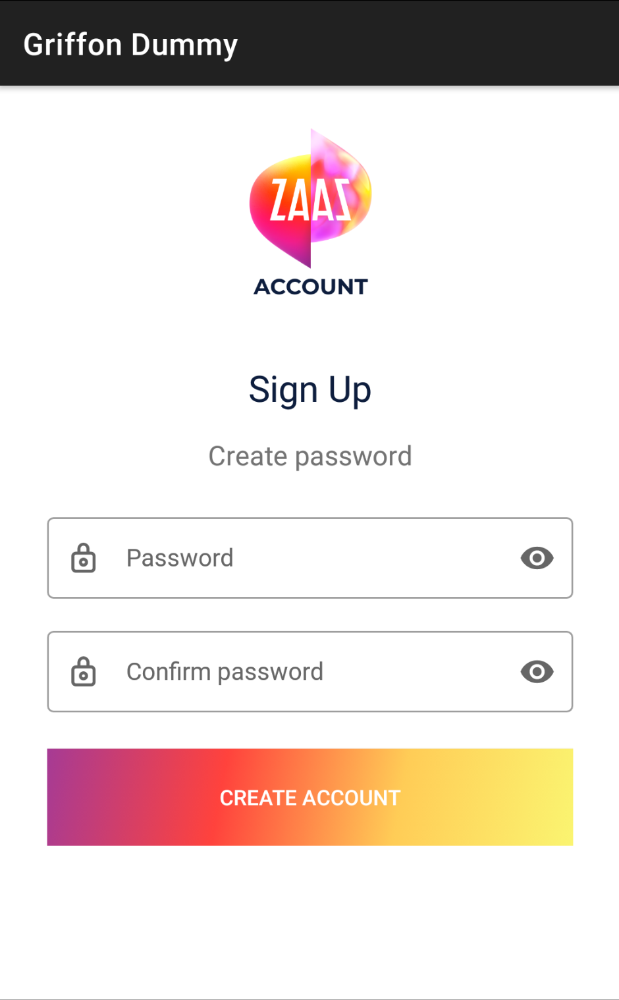

Authorization client

## Step 1: Login

## Step 2: Register
### Enter email or phone and agree with terms

### If phone entered, provide SMS code (by default = 000000)
### If email entered, then skip this step

### Create password

